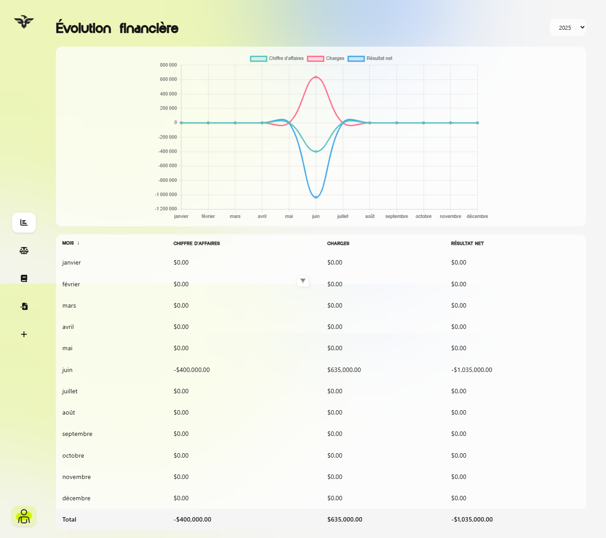
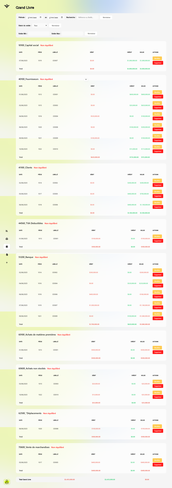
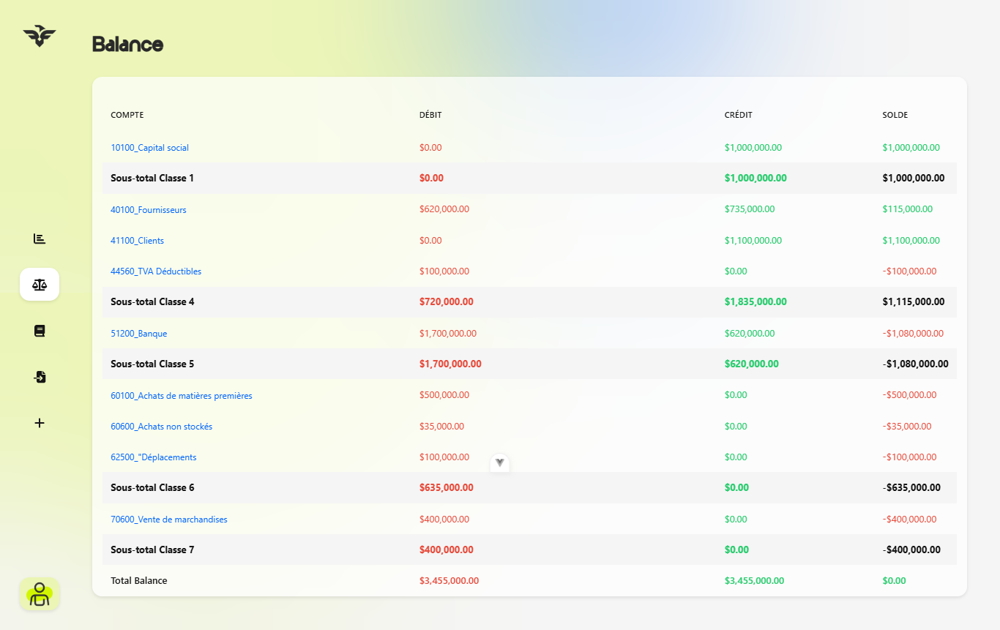

# Fiscaleo


Un **tableau de bord financier moderne** conçu pour simplifier les opérations comptables au sein de l’écosystème ERP iDempiere.

Fiscaleo fait le lien entre des **données comptables complexes** issues d’un ERP et une interface frontend **moderne**, **réactive** et **intuitive**. Le projet permet aux comptables et aux utilisateurs métiers de suivre l’activité financière, analyser les données comptables et gérer les opérations du grand livre **en temps réel**.


## ✨ Fonctionnalités

- 📈 Suivi de l’évolution financière **en temps réel**
- 📊 Visualisation interactive des données financières
- 📚 Grand Livre avancé avec **filtres multicritères**
- ⚖️ Affichage de la balance comptable
- 📥 Import massif de données comptables via **CSV**
- 🔐 Intégration sécurisée avec les **API REST iDempiere**
- ⚡ Interface utilisateur **rapide** et **réactive**
- 🧩 Architecture frontend **modulaire** et **scalable**

## 🛠️ Tech Stack
### Frontend
- Vue.js 3.4
- JavaScript
- Vite
- Axios
- Chart.js 4

### Backend / ERP
- API REST iDempiere

## 🎯 Objectif du Projet
Les interfaces comptables des ERP traditionnels sont souvent **complexes**, peu intuitives et surchargées.

Fiscaleo a été conçu pour offrir une expérience utilisateur plus **moderne**, **fluide** et **lisible**, tout en conservant l’accès aux opérations comptables essentielles et aux indicateurs financiers **en temps réel**.

L’objectif principal du projet est d’améliorer la **productivité**, la **lisibilité des données** et le **suivi financier** au sein d’un environnement ERP.

## 🧠 Approche de Développement
Ce projet a été développé avec une attention particulière portée sur :

- Une architecture **propre** et **maintenable**
- Du code **réutilisable** et **scalable**
- Une expérience utilisateur **fluide** et **intuitive**
- Les **performances** et la **cohérence des données**
- Une séparation claire entre **logique métier** et **interface utilisateur**

## 📸 Screenshots

### Dashboard


### General Ledger


### Trial Balance


## 📂 Project Structure
```bash
src/
├── components/     # Composants UI réutilisables
├── views/          # Pages principales de l’application
├── layouts/        # Layouts et structures globales des pages
├── router/         # Configuration des routes Vue Router
├── services/       # Communication avec les APIs et logique métier
├── utils/          # Fonctions utilitaires
└── assets/         # Ressources statiques (images, styles, icônes...)
```
## 🔮 Future Improvements
- Export PDF des rapports financiers
- Gestion des rôles et permissions
- Analyses financières avancées
- Support du mode sombre
- Gestion multi-sociétés
- Notifications en temps réel
## 👩‍💻 Author
**Voarisoa Marinah**

Passionnée par la création d’applications **modernes**, **scalables** et **intuitives**, alliant développement logiciel et expérience utilisateur.
